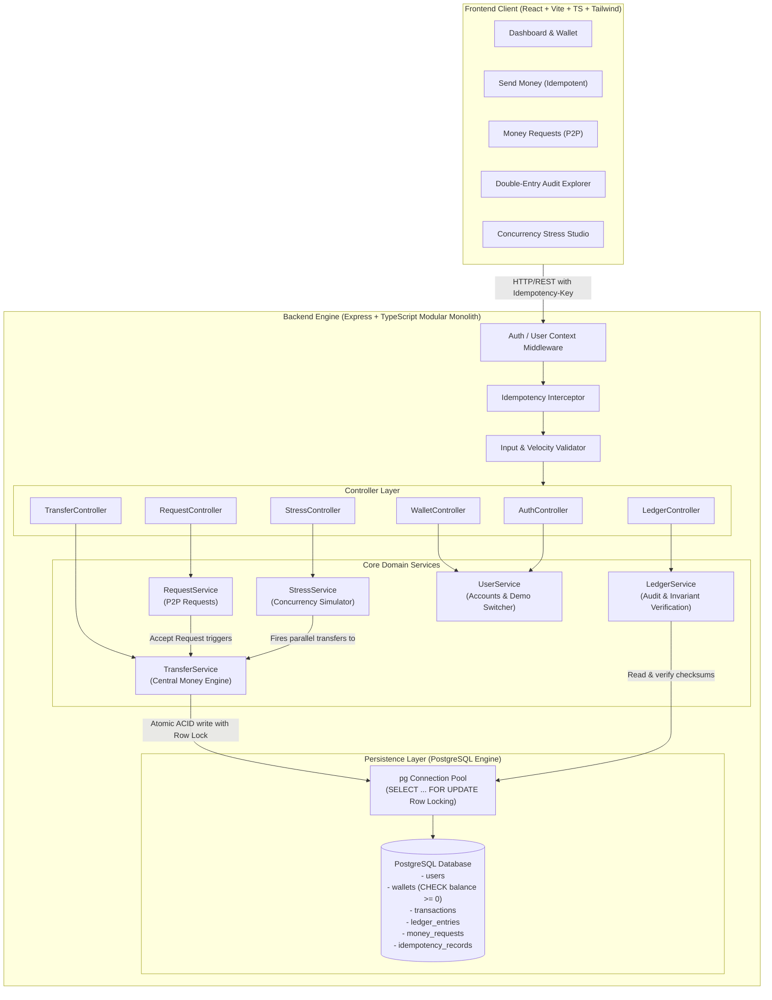
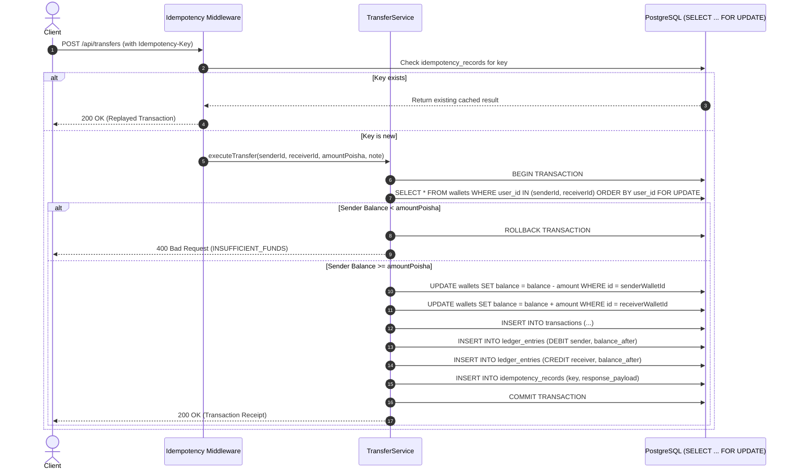

# NexusPay Engine: System Architecture Specification (PostgreSQL Engine)
**PSTU National Hackathon 2026 — Money Movement Application Challenge**

---

## 1. System Overview

NexusPay is an enterprise-grade, high-throughput digital money movement engine designed for zero financial discrepancy, strict ACID atomicity, double-entry auditability, and deterministic race-condition defense under extreme concurrency.



---

## 2. Architectural Layers & Boundaries

```
pstu_hack/
├── backend_files/                  # Express + TypeScript Modular Monolith (PostgreSQL)
│   ├── src/
│   │   ├── config/
│   │   │   └── db.ts              # PostgreSQL Pool connection & type parsers
│   │   ├── db/
│   │   │   ├── schema.sql         # DDL: Relational normalized tables with BIGINT poisha
│   │   │   ├── seed.ts            # 5 demo accounts auto-funded with BDT 100,000 (10,000,000 poisha)
│   │   │   ├── init.ts            # Schema initializer
│   │   │   └── testDb.ts          # Database constraint & invariant verification
│   │   ├── middlewares/
│   │   │   ├── auth.ts            # User session & simulated token auth
│   │   │   └── idempotency.ts     # Duplicate request detector & cached response replay
│   │   ├── services/
│   │   │   ├── transferService.ts # Central money engine with SELECT ... FOR UPDATE locking
│   │   │   ├── ledgerService.ts   # Double-entry ledger invariant & mathematical audit
│   │   │   ├── requestService.ts  # P2P invoice & settlement routing
│   │   │   ├── userService.ts     # Profile, balance query & demo user switcher
│   │   │   └── stressService.ts   # Parallel worker / thread stress simulator
│   │   ├── controllers/
│   │   │   ├── transferController.ts
│   │   │   ├── requestController.ts
│   │   │   ├── ledgerController.ts
│   │   │   ├── userController.ts
│   │   │   └── stressController.ts
│   │   ├── routes/
│   │   │   └── api.ts             # Central API router
│   │   ├── tests/
│   │   │   └── backendTests.ts    # Comprehensive integration & concurrency test suite
│   │   ├── types/
│   │   │   └── index.ts           # Domain models, DTOs & response schemas
│   │   ├── app.ts                 # Express app configuration
│   │   └── server.ts              # Express server entry point
│   ├── .env                       # Environment configuration
│   ├── .env.example
│   ├── package.json
│   └── tsconfig.json
├── frontend_files/                 # React + Vite + TypeScript Frontend
└── README.md                       # Architectural documentation, ACID defense & demo guide
```

---

## 3. Core Financial Engineering Invariants

### 1. Integer Poisha Representation
- All currency amounts are stored and calculated strictly as integers in **Poisha** ($1\text{ BDT} = 100\text{ Poisha}$) in `BIGINT`.
- Floating-point numbers are forbidden in storage, calculations, and internal payloads to eliminate IEEE 754 precision loss.

### 2. Centralized Transfer Engine (`TransferService`)
- All fund movements (Direct P2P Transfer, Request Settlement, Stress Batching) MUST pass through `TransferService.executeTransfer()`. No controller or sub-service modifies wallet balances directly.

### 3. ACID Atomicity & Row-Level Locking (`SELECT ... FOR UPDATE`)
- In PostgreSQL, transfers acquire row-level write locks (`SELECT ... FOR UPDATE`) in deterministic alphabetical order of `user_id` to prevent deadlocks under concurrent cross-transfers.
- Negative balances are mathematically impossible due to:
  1. Service-level pre-check: `sender_balance >= amount`.
  2. Database constraint: `CHECK (balance >= 0)`.
  3. Atomic updates in a single `BEGIN ... COMMIT` transaction.



### 4. Double-Entry Auditable Ledger Invariant
- Every transaction creates exactly two immutable ledger records:
  - **DEBIT** entry for Sender with new `balance_after`.
  - **CREDIT** entry for Receiver with new `balance_after`.
- Mathematical Invariant enforced and verified via `/api/ledger/audit`:
  $$\sum \text{Debit Amounts} - \sum \text{Credit Amounts} \equiv 0$$
  $$\sum \text{Wallet Balances} = \text{Total System Injected Money}$$

### 5. Deterministic Idempotency Guarantee
- Every mutation request generates or supplies an `Idempotency-Key`.
- If a key was already processed, the identical HTTP response is returned immediately from `idempotency_records` without triggering duplicate debits.

---

## 4. Environment Variables

| Variable | Default | Description |
|---|---|---|
| `PORT` | `5001` | Express API Server Port |
| `DATABASE_URL` | `postgresql://localhost:5432/nexuspay` | Connection string |
| `PGHOST` | `localhost` | PostgreSQL Host |
| `PGPORT` | `5432` | PostgreSQL Port |
| `PGDATABASE` | `nexuspay` | Database Name |
| `PGUSER` | Current User | Database Username |
| `PGPASSWORD` | `""` | Database Password |
