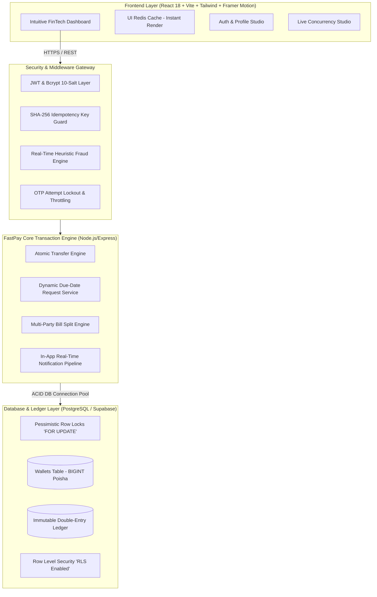

# ⚡ FastPay: Enterprise Digital Money Movement Platform
> **PSTU National Hackathon 2026 — Money Movement Application Challenge**  
> *Engineered for High-Concurrency, Zero Financial Discrepancy, Strict ACID Atomicity & Real-Time Fraud Defense.*

---

## 📑 Table of Contents
1. [Executive Summary & Problem Statement](#-executive-summary)
2. [High-Level System Architecture](#-system-architecture)
3. [Core Capabilities & Innovation](#-core-capabilities)
4. [Enterprise Financial Integrity & Concurrency Defense](#-financial-integrity--concurrency-defense)
5. [Real-Time Anti-Fraud & Risk Engine](#-real-time-anti-fraud--risk-engine)
6. [Complete REST API Reference](#-rest-api-reference)
7. [Local & Cloud Setup Instructions](#-setup--deployment)
8. [3-Minute Live Demo Pitch & Judging Flow](#-3-minute-demo-flow-for-judges)
9. [Tech Stack & Security Matrices](#-tech-stack--security-matrices)

---

## 🎯 Executive Summary

Modern FinTech platforms face three fundamental challenges:
1. **Race Conditions & Double-Spending**: When multiple burst transactions hit the same wallet simultaneously.
2. **Financial Drift & Discrepancies**: Decimal/floating-point calculation errors and partial state failures.
3. **Replay & Fraud Attacks**: Duplicate network retries, unauthorized bursts, and wallet liquidation attempts.

**FastPay** solves these challenges from the ground up using **Pessimistic Row-Level Locking (`SELECT ... FOR UPDATE`) in deterministic sorted order**, **Integer Poisha Arithmetic ($1\text{ BDT} = 100\text{ Poisha}$)**, an **Immutable Double-Entry Ledger ($\sum\text{Debits} = \sum\text{Credits}$)**, and a **Real-Time Heuristic Fraud Engine**.

---

## 🏛 System Architecture



---

## 🌟 Core Capabilities

| Feature | Description |
| :--- | :--- |
| **💸 Atomic P2P Money Movement** | Real-time transfers with zero race conditions, sub-second execution, and instant digital receipt generation. |
| **👥 Friends & Family Ecosystem** | Social connection tagging (`FRIEND` / `FAMILY`) with a 1-tap quick transfer tray. |
| **⏳ Smart Due-Date Money Requests** | Set loan repayment deadlines (`due_date`) with real-time computed `OVERDUE` / `DUE_SOON` status badges. |
| **🔔 Real-Time In-App Notifications** | Instant alerts on incoming transfers, received invoices, accepted payments, and overdue loan alerts. |
| **🍕 Multi-Party Universal Bill Split** | Split dining, travel, tour, or team registration bills among participants with atomic 1-click share settlement. |
| **⚡ Live Concurrency & Stress Studio** | A live test studio firing 20–50 simultaneous threads against a single wallet to visually demonstrate zero double-spending. |
| **📜 System-Wide Double-Entry Audit** | Instant verification that total debits match total credits with $\Delta = 0$ discrepancy. |
| **🛡 Real-Time Anti-Fraud Engine** | Dynamic risk scoring ($0 - 100$) evaluating transaction velocity, liquidation patterns, and unusual amounts. |

---

## 🛡 Financial Integrity & Concurrency Defense

### 1. Deterministic Row-Level Locking (`SELECT ... FOR UPDATE`)
To prevent race conditions and eliminate deadlocks:
- When User A transfers money to User B, FastPay queries both wallets within an atomic `BEGIN` transaction.
- Wallets are locked in **lexicographical order of `wallet_id`** (`ORDER BY id ASC`).
- This guarantees that even if User A pays User B while User B pays User A at the exact same millisecond, locks are acquired in an identical sequence, completely avoiding deadlocks.

```sql
-- Atomic Row Lock inside PostgreSQL Transaction
SELECT id, user_id, balance, status 
FROM wallets 
WHERE id IN ($1, $2) 
ORDER BY id ASC 
FOR UPDATE;
```

### 2. Double-Entry Bookkeeping Invariant
Every transaction writes an immutable pair of ledger entries:
- **Debit** record on sender wallet.
- **Credit** record on receiver wallet.
- **Mathematical Invariant**:
  $$\sum \text{Debits} - \sum \text{Credits} \equiv 0$$
No money is ever created or destroyed out of thin air.

### 3. Zero-Float Integer Poisha Storage
All balances and transactions are stored as `BIGINT` in integer **Poisha** ($1\text{ BDT} = 100\text{ Poisha}$).
- Eliminates floating-point rounding errors (e.g., `0.1 + 0.2 = 0.30000000000000004`).
- Precision is $100\%$ preserved down to the single poisha.

### 4. Idempotency Key Guard
All mutating endpoints support the `Idempotency-Key` header.
- A SHA-256 hash of the request is verified before execution.
- If a client retries a request due to network dropouts or double-clicking, the server returns the cached success response without re-debiting funds.

---

## 🚨 Real-Time Anti-Fraud & Risk Engine

FastPay features a multi-rule heuristic fraud detection pipeline:

```
+-------------------------------------------------------------------------------+
|                       REAL-TIME FRAUD EVALUATION PIPELINE                     |
|                                                                               |
|  [Velocity Check]            [Amount Anomaly]         [Liquidation Pattern]   |
|  >3 transfers / 60s (+20)    >৳25,000 (+25)          >95% balance drain (+20) |
|  >5 transfers / 60s (+45)    >৳50,000 (+40)          New recipient (+15)      |
+---------------------------------------+---------------------------------------+
                                        |
                                        v
+-------------------------------------------------------------------------------+
| Risk Score: 0 - 100                                                           |
|  - Score 0 - 29   : LOW RISK       -> Auto Approved                           |
|  - Score 30 - 79  : MEDIUM / HIGH  -> Step-Up Challenge / Warning             |
|  - Score 80 - 100 : CRITICAL RISK  -> Blocked & Audited                       |
+-------------------------------------------------------------------------------+
```

---

## 📡 REST API Reference

### Authentication & Profiles
| Method | Endpoint | Description |
| :--- | :--- | :--- |
| `POST` | `/api/auth/register` | Register new user with phone & avatar (Triggers OTP) |
| `POST` | `/api/auth/verify-otp` | Verify 6-digit SMS OTP and receive JWT |
| `POST` | `/api/auth/login` | Log in with verified phone & password |
| `GET` | `/api/auth/me` | Fetch authenticated user profile & live wallet balance |
| `PUT` | `/api/auth/profile` | Update profile information (name, email, avatar) |

### Money Movement & Transactions
| Method | Endpoint | Description |
| :--- | :--- | :--- |
| `POST` | `/api/transfers` | Execute atomic P2P transfer (Supports `Idempotency-Key`) |
| `GET` | `/api/transfers/history` | Get user transaction history with status & metadata |
| `POST` | `/api/requests` | Create a money request with optional `due_date` |
| `GET` | `/api/requests` | List incoming & outgoing requests with computed loan status |
| `POST` | `/api/requests/:id/accept`| Atomically settle and pay a money request |
| `POST` | `/api/requests/:id/reject`| Decline an incoming money request |

### Bill Splits & Notifications
| Method | Endpoint | Description |
| :--- | :--- | :--- |
| `POST` | `/api/splits` | Create a multi-user bill split |
| `GET` | `/api/splits` | Fetch active bill splits with live settlement progress |
| `POST` | `/api/splits/:id/pay` | Pay participant's allocated bill share atomically |
| `GET` | `/api/notifications` | Fetch unread in-app alerts and debt reminders |
| `PUT` | `/api/notifications/:id/read` | Mark notification as read |
| `PUT` | `/api/notifications/read-all` | Mark all notifications as read |

### System & Audit
| Method | Endpoint | Description |
| :--- | :--- | :--- |
| `GET` | `/api/ledger/audit` | Execute system-wide double-entry ledger balance check |
| `GET` | `/api/ledger/entries` | Fetch paginated immutable ledger audit stream |
| `POST` | `/api/stress/simulate`| Execute multi-threaded concurrency stress test |
| `POST` | `/api/users/reset-demo`| Reset demo persona balances to ৳100,000 |

---

## 💻 Setup & Deployment

### Prerequisites
- Node.js `v18.0+`
- PostgreSQL `14+` (or Supabase Cloud Database)

### 1. Backend Setup
```bash
# Navigate to backend directory
cd backend_files

# Install dependencies
npm install

# Initialize database schema and Row Level Security
npm run db:init

# Seed demo users & mock data
npm run db:seed

# Run production-grade test suite
npm run test:all

# Start backend dev server (Port 5001)
npm run dev
```

### 2. Frontend Setup
```bash
# Navigate to frontend directory
cd frontend_files

# Install dependencies
npm install

# Start Vite dev server (Port 5173 / 5177)
npm run dev
```

---

## ⏱️ 3-Minute Demo Flow for Judges

1. **Minute 1: Real-Time Atomic Transfer & Notifications**
   - Log in as **Shakib (01711223344)**.
   - Send **৳2,500** to **Tanmoy (01811223344)** using the 1-Tap Friends tray.
   - Switch persona to Tanmoy: Show the **instant notification badge** and updated balance.
2. **Minute 2: Due-Date Request & Universal Bill Split**
   - Create a **৳1,200 Dinner Split** with 3 friends.
   - Tanmoy pays his share in 1 click; show the live progress bar fill up.
   - Create a loan request with tomorrow's deadline; show the dynamic `DUE_SOON` badge.
3. **Minute 3: The Concurrency Studio & Ledger Invariant (Showstopper ⚡)**
   - Open **Concurrency Lab** from the top navigation bar.
   - Fire **20 simultaneous parallel transfer threads** against a single ৳1,000 balance.
   - Show that exactly 2 transfers succeed (৳500 $\times$ 2 = ৳1,000), remaining 18 are rejected gracefully, sender balance reaches exactly ৳0, double-spend is **ZERO**, and the Double-Entry Ledger is **$100\%$ balanced**.

---

## 🔒 Security Summary

- **Authentication**: JWT HS256 + Bcrypt (10 Salt Rounds)
- **SMS OTP**: 6-digit cryptographic verification with 5-attempt lockout
- **Anti-Fraud**: Heuristic real-time risk scoring engine (Velocity + Liquidation rules)
- **Database**: PostgreSQL Row-Level Locking (`FOR UPDATE`) + Row Level Security (RLS)
- **Data Integrity**: Double-Entry Immutable Ledger + Zero-Float Integer Poisha

---
*Built with ❤️ for PSTU National Hackathon 2026.*
